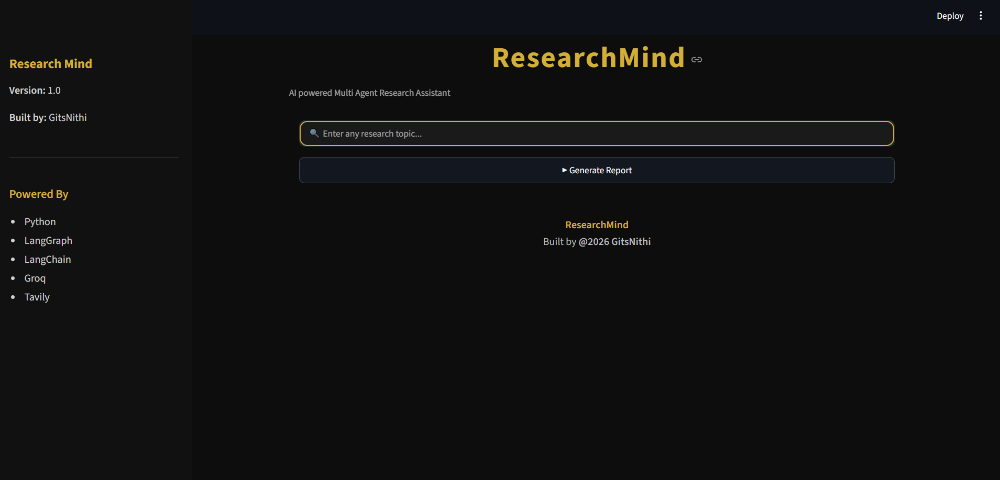
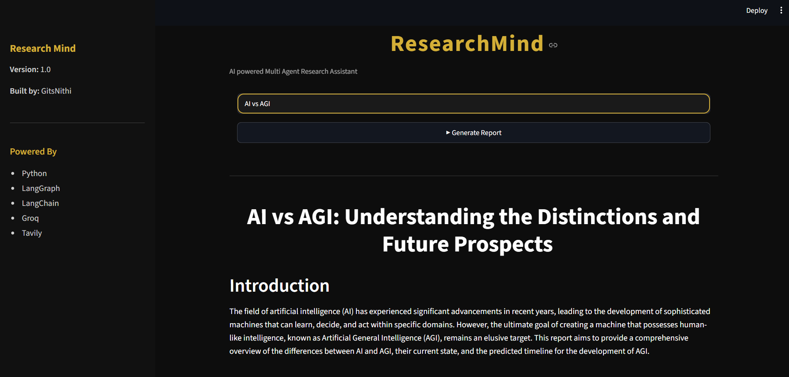
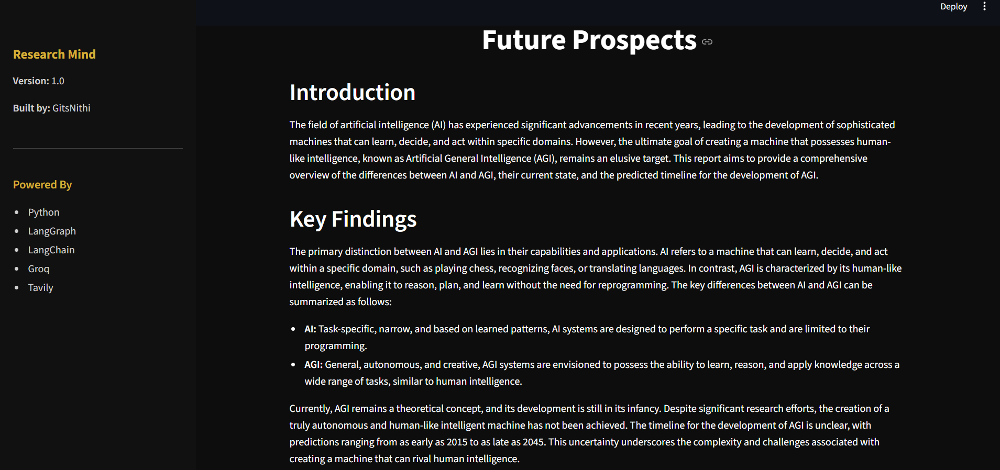
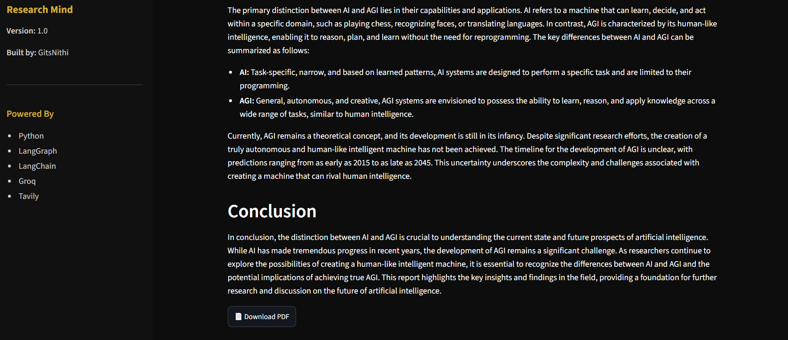

# 🧠 Research Mind

> **Multi-Agent AI Research Assistant powered by LangGraph, LangChain, Groq, Tavily Search, and Streamlit.**

Research Mind is a Multi-Agent AI application that automates the complete research workflow—from planning and web research to information extraction, summarization, and professional report generation. The system orchestrates multiple AI agents using **LangGraph** to deliver structured, high-quality research reports through a clean and modern web interface.

---

# 📸 Screenshots

## 🏠 Home Page



---

## 📄 Research Report 



---

## 📄 Research Report 



---

## 📄 Research Report



---

# ✨ Features

- 🤖 Multi-Agent AI Workflow
- 🔍 AI-powered Research Planning
- 🌐 Real-time Web Search using Tavily
- 📄 Intelligent Information Extraction
- 🧠 AI-powered Summarization
- 📝 Professional Research Report Generation
- 📥 Export Report as PDF
- 🎨 Modern Streamlit Interface
- ⚡ Modular Architecture using LangGraph

---

# ⚙️ Tech Stack

- Python
- LangChain
- LangGraph
- Groq LLM
- Tavily Search API
- Streamlit
- ReportLab
- Python-dotenv

---

# 🧩 Multi-Agent Workflow

```text
User
   │
   ▼
Planner Agent
   │
   ▼
Search Agent
   │
   ▼
Extractor Agent
   │
   ▼
Summarizer Agent
   │
   ▼
Writer Agent
   │
   ▼
Final Research Report
```

---

# 📂 Project Structure

```text
Research Mind
│
├── app
│   ├── agents
│   │   ├── planner.py
│   │   ├── search.py
│   │   ├── extractor.py
│   │   ├── summarizer.py
│   │   └── writer.py
│   │
│   ├── graph
│   │   ├── state.py
│   │   └── workflow.py
│   │
│   ├── tools
│   │   ├── search_tool.py
│   │   └── pdf_export.py
│   │
│   ├── ui
│   │   ├── streamlit_app.py
│   │   └── styles.css
│   │
│   ├── config.py
│   └── llm.py
│
├── assets
│   ├── home.png
│   ├── report1.png
│   ├── report2.png
│   └── report3.png
│
├── data
├── reports
├── requirements.txt
├── .env
└── README.md
```

---

# 🚀 Installation

### Clone the repository

```bash
git clone https://github.com/your-username/Research-Mind.git
```

### Navigate to the project

```bash
cd Research-Mind
```

### Create a virtual environment

```bash
python -m venv venv
```

### Activate the virtual environment

#### Windows

```bash
venv\Scripts\activate
```

### Install dependencies

```bash
pip install -r requirements.txt
```

---

# 🔑 Environment Variables

Create a `.env` file in the project root.

```env
GROQ_API_KEY=your_groq_api_key
TAVILY_API_KEY=your_tavily_api_key
```

---

# ▶️ Run the Application

```bash
python -m streamlit run app/ui/streamlit_app.py
```

---

# 📄 Output

The application generates:

- Structured AI Research Report
- AI-generated Summary
- Downloadable PDF Report

---

# 👨‍💻 Developed By

**Nithi**

GitHub: **GitsNithi**

---

# 📜 License

This project is intended for educational, learning, and portfolio purposes.
